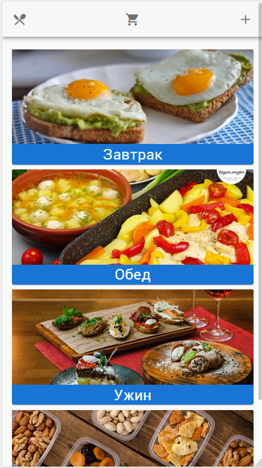
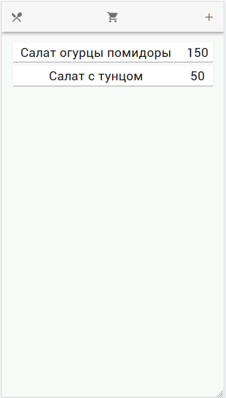
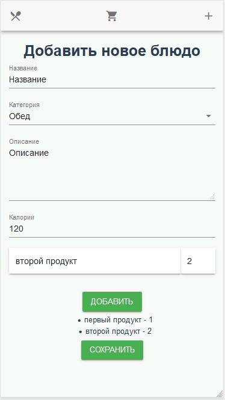
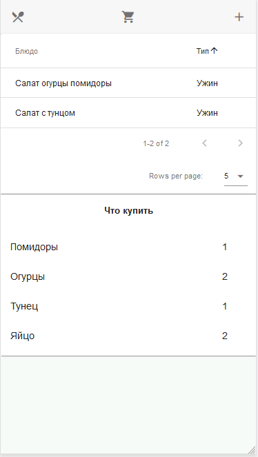

# Cookbook
## This is a project whith made by Nodejs, Vue, lokijs, socket. io
### This application can store your recipes and count how many products you need to buy
```
run server in /server
npm start
run client in /client
npm start
go to localhost:8080
```





